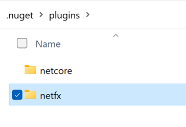
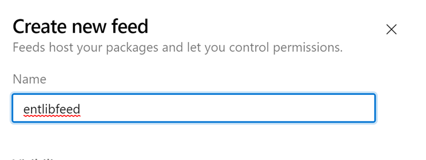
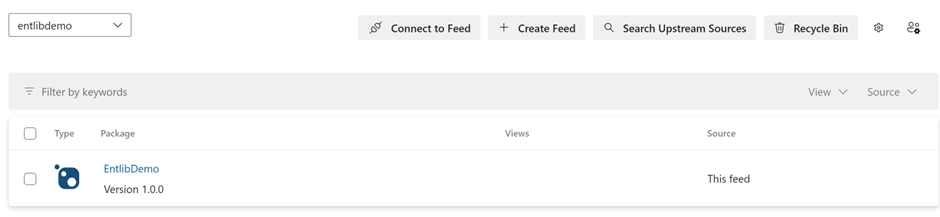
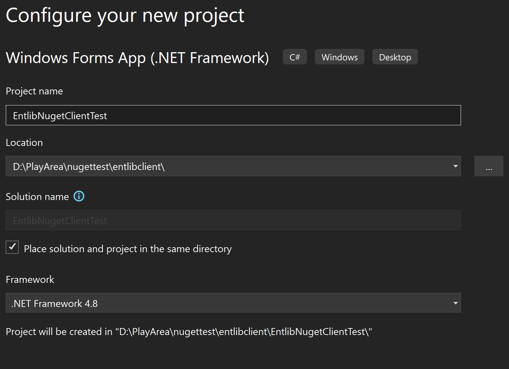
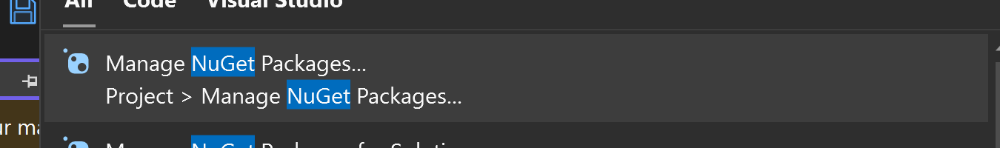
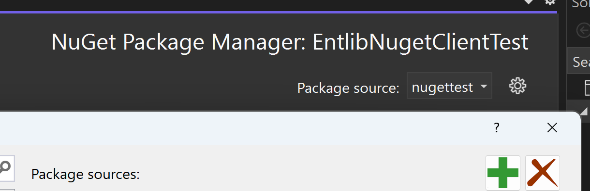
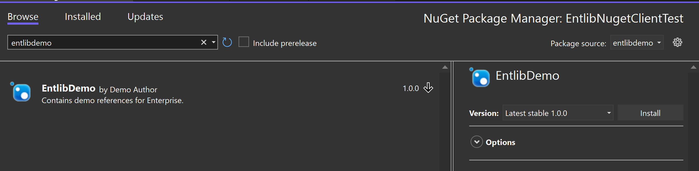

# Scenario

- You have the binaries  (i.e no source code), and there is no existing nuget package. 
- You want to create a nuget package from these binaries and publish it to Azure DevOps feed. 
- You want to use the package in a .NET Framework project (although the steps could apply for .Net Core)

# Download the tools.

Check the documentation at https://learn.microsoft.com/en-us/azure/devops/artifacts/nuget/nuget-exe?view=azure-devops

The current "get the tools" points to the following location

### Nuget 
https://go.microsoft.com/fwlink/?linkid=2099732 which redirects to https://www.nuget.org/downloads
Download the recommended option

Put the nuget.exe somewhere in your path. In my case I maintain a utils directory which is in my path and I copy the nuget.exe into this directory. This is optional but does make your life easier

### Download and install the credential provider
https://go.microsoft.com/fwlink/?linkid=2099625 which redirect to https://github.com/microsoft/artifacts-credprovider#azure-artifacts-credential-provider

I followed the manual installation option. i.e to download from Microsoft.NuGet.CredentialProvider.zip from https://github.com/Microsoft/artifacts-credprovider/releases and Copy the netcore (and netfx for nuget.exe) directory from the extracted archive to $env:UserProfile\.nuget\plugins (%UserProfile%/.nuget/plugins/)
Below in a screenshot of the folders in my .nuget/plugins directory



# Get the artifacts into a directory 
Get the artifacts you want to package -and copy them into a directory. You can decide the name. I have called this directory entlib. I have taken some dlls from the old enterprise library and put 3 of them into this directory. You will find this directory and dlls in the github repo

# Create the nuspec file
I have created a entlib.nuspec file that looks similar to below
```xml
<?xml version="1.0" encoding="utf-8"?>
<package xmlns="http://schemas.microsoft.com/packaging/2011/08/nuspec.xsd">
  <metadata>
    <id>EntlibDemo</id>
    <version>1.0.0</version>
    <title>Enterprise Library Demo</title>
    <authors>Demo Author</authors>
    <owners>Demo Author</owners>
    <iconUrl>https://www.somewhere.com/demo.png</iconUrl>
    <requireLicenseAcceptance>false</requireLicenseAcceptance>
    <description>Contains demo references for Enterprise.</description>
    <references>
		<reference file="Microsoft.Practices.EnterpriseLibrary.Data.dll" />
		<reference file="Microsoft.Practices.EnterpriseLibrary.Data.SqlCe.dll" />
    </references>
  </metadata>
  <files>
    <file src="entlib\Microsoft.Practices.EnterpriseLibrary.Data.dll" target="lib\" />
    <file src="entlib\Microsoft.Practices.EnterpriseLibrary.Data.SqlCe.dll" target="lib\" />
  </files>
</package>
```

# Create the package 
run the following command from the command line in the directory where you have the nuspec file
```console
nuget pack entlib.nuspec
```

You should see a new file called EntlibDemo.1.0.0.nupkg

#  Create the nuget feed in Azure DevOps
In Azure Devops
- click on Artifacts
- click on Create Feed
- give it a name and click on Create


- Click on Connect to feed
- Click on Nuget.exe
- Copy the xml from project setup and paste into a file called nuget.config
below is an example. Do not use this. It is just an example. You will need to get the xml from your project

```xml
<?xml version="1.0" encoding="utf-8"?>
<configuration>
  <packageSources>
    <clear />
<add key="entlibdemo" value="https://pkgs.dev.azure.com/orgname/projectname/_packaging/entlibdemo/nuget/v3/index.json" />
  </packageSources>
</configuration>
```

# Publish the package
From the same page, you will find the command to publish the package. It will look something like below.
I have put in the reference to  EntlibDemo.1.0.0.nupkg which we created earlier
```console
nuget.exe push EntlibDemo.1.0.0.nupkg -Source "entlibdemo" -ApiKey az 
```
You should see the package published in the Azure DevOps feed, similar to the screenshot below




# use the package
In this instance the package is based on .NET Framework. 
Create a new project eg Windows Forms or Console App
I created a Windows Forms project


You can now use the package in your project. 
Or you can use Visual Studio to add the nuget feed







if the feed does not exist, click the + button and add the feed.

